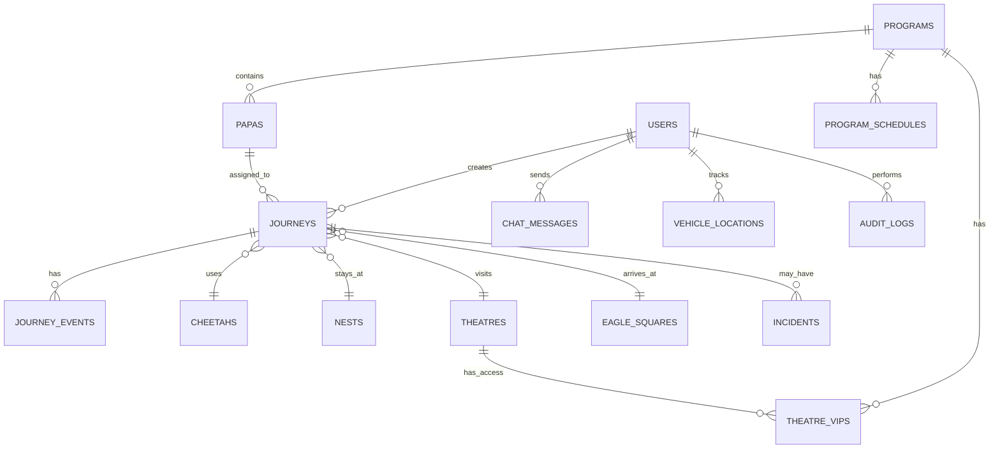

# TCNP Journey Management - System Architecture

> **Technical Interview Documentation**  
> Comprehensive overview of architecture, design decisions, and implementation details

---

## Table of Contents
1. [System Overview](#system-overview)
2. [Technology Stack](#technology-stack)
3. [Architecture Layers](#architecture-layers)
4. [Database Schema](#database-schema)
5. [Authentication & Authorization](#authentication--authorization)
6. [Real-time Features](#real-time-features)
7. [Key Features](#key-features)
8. [Performance & Scalability](#performance--scalability)
9. [Security Considerations](#security-considerations)
10. [Deployment Architecture](#deployment-architecture)

---

## System Overview

**TCNP Journey Management** is a real-time operations management system designed for coordinating VIP movements, venue logistics, and multi-team coordination during high-profile events.

### Business Problem
- Track VIP movements across multiple venues in real-time
- Coordinate multiple teams (transport, security, venue management)
- Provide instant communication via call signs and chat
- Maintain audit trails for security and accountability

### Solution Approach
A Progressive Web App (PWA) with real-time collaboration, GPS tracking, role-based access control, and offline capabilities.

---

## Technology Stack

### Frontend
```
┌─────────────────────────────────────┐
│ Next.js 14+ (App Router)            │
│ ├─ React 18 (Server Components)     │
│ ├─ TypeScript (Type Safety)         │
│ ├─ Tailwind CSS (Styling)           │
│ └─ Shadcn UI (Component Library)    │
└─────────────────────────────────────┘
```

### Backend & Database
```
┌─────────────────────────────────────┐
│ Supabase (BaaS Platform)            │
│ ├─ PostgreSQL 15 (Database)         │
│ ├─ PostGIS (Geospatial Extension)   │
│ ├─ Row Level Security (RLS)         │
│ ├─ Edge Functions (API)             │
│ └─ Realtime (WebSocket)             │
└─────────────────────────────────────┘
```

### Infrastructure
- **Hosting**: Vercel (Frontend) + Supabase Cloud (Backend)
- **CDN**: Vercel Edge Network
- **Storage**: Supabase Storage (Photos, Assets)
- **Real-time**: Supabase Realtime (WebSocket)

---

## Architecture Layers

### High-Level Architecture

```
┌────────────────────────────────────────────────────────────┐
│                        CLIENT LAYER                         │
│  ┌──────────────┐  ┌──────────────┐  ┌──────────────┐     │
│  │   Desktop    │  │    Tablet    │  │    Mobile    │     │
│  │   Browser    │  │    Browser   │  │    Browser   │     │
│  └──────────────┘  └──────────────┘  └──────────────┘     │
└────────────────────────────────────────────────────────────┘
                            ↓
┌────────────────────────────────────────────────────────────┐
│                     APPLICATION LAYER                       │
│  ┌──────────────────────────────────────────────────────┐  │
│  │  Next.js App Router (SSR + Client Components)        │  │
│  │  ├─ Server Components (Data Fetching)               │  │
│  │  ├─ Client Components (Interactivity)               │  │
│  │  ├─ API Routes (Backend Logic)                      │  │
│  │  └─ Middleware (Auth, Routing)                      │  │
│  └──────────────────────────────────────────────────────┘  │
└────────────────────────────────────────────────────────────┘
                            ↓
┌────────────────────────────────────────────────────────────┐
│                      DATA LAYER                             │
│  ┌──────────────────────────────────────────────────────┐  │
│  │  Supabase Backend                                    │  │
│  │  ├─ PostgreSQL (Relational Data)                    │  │
│  │  ├─ PostGIS (Geospatial Data)                       │  │
│  │  ├─ Storage (Files, Photos)                         │  │
│  │  ├─ Realtime (WebSocket)                            │  │
│  │  └─ Auth (JWT + RLS)                                │  │
│  └──────────────────────────────────────────────────────┘  │
└────────────────────────────────────────────────────────────┘
```

### Detailed Component Architecture

```
src/
├── app/                       # Next.js App Router
│   ├── (auth)/               # Authentication routes
│   │   └── login/            # Login page
│   ├── (dashboard)/          # Protected dashboard routes
│   │   ├── dashboard/        # Main dashboard
│   │   ├── chat/             # Real-time chat
│   │   ├── tracking/         # GPS tracking
│   │   ├── operations-monitor/ # Call sign updates
│   │   ├── papas/            # VIP management
│   │   ├── cheetahs/         # Fleet management
│   │   ├── nests/            # Hotel management
│   │   ├── theatres/         # Venue management
│   │   ├── officers/         # Personnel management
│   │   ├── programs/         # Event programs
│   │   ├── incidents/        # Incident reporting
│   │   └── audit-logs/       # Audit trail
│   └── api/                  # API routes
│       ├── admin/            # Admin operations
│       ├── journeys/         # Journey management
│       └── officers/         # Officer management
│
├── components/               # React components
│   ├── chat/                 # Chat system
│   ├── tracking/             # Location tracking
│   ├── operations/           # Operations components
│   ├── papas/                # VIP components
│   ├── theatre/              # Venue components
│   ├── programs/             # Program components
│   ├── ui/                   # Shadcn UI components
│   └── providers/            # Context providers
│
├── hooks/                    # Custom React hooks
│   ├── useLocationTracking.ts
│   ├── useJourneyStatus.ts
│   └── useCurrentUser.ts
│
├── lib/                      # Utility libraries
│   ├── supabase/             # Supabase clients
│   │   ├── client.ts         # Browser client
│   │   ├── server.ts         # Server client
│   │   └── admin.ts          # Admin client
│   ├── services/             # Business logic
│   │   └── notificationService.ts
│   ├── utils/                # Utility functions
│   │   └── devLogger.ts
│   └── constants/            # App constants
│       └── call-signs.ts
│
└── public/                   # Static assets
    ├── sw.js                 # Service worker (PWA)
    ├── manifest.json         # PWA manifest
    └── offline.html          # Offline fallback
```

---

## Database Schema

### Entity Relationship Diagram



### Core Entities

#### Users & Roles
```sql
users (
  id UUID PK,
  email TEXT UNIQUE,
  full_name TEXT,
  role user_role,           -- Enum: super_admin, admin, captain, etc.
  current_title_id UUID FK, -- Official title
  is_active BOOLEAN,
  is_online BOOLEAN,
  last_seen TIMESTAMPTZ
)

official_titles (
  id UUID PK,
  code TEXT,                -- e.g., 'CAPTAIN', 'DELTA_OSCAR'
  display_name TEXT,
  permissions JSONB
)
```

#### Programs & VIPs
```sql
programs (
  id UUID PK,
  name TEXT,                -- e.g., 'WOFBEC 2026'
  status TEXT,              -- active, upcoming, completed
  start_date TIMESTAMPTZ,
  end_date TIMESTAMPTZ
)

papas (
  id UUID PK,
  full_name TEXT,
  title TEXT,
  nationality TEXT,
  passport_number TEXT,
  flight_number TEXT,
  flight_arrival_time TIMESTAMPTZ,
  profile_photo_url TEXT
)
```

#### Operations
```sql
journeys (
  id UUID PK,
  papa_id UUID FK,
  status journey_status,     -- Enum: planned, enroute, completed, etc.
  current_call_sign call_sign, -- Enum: First Course, Chapman, etc.
  assigned_cheetah_id UUID FK,  -- Vehicle
  assigned_nest_id UUID FK,     -- Hotel
  assigned_theatre_id UUID FK,  -- Venue
  last_latitude NUMERIC,
  last_longitude NUMERIC
)

journey_events (
  id UUID PK,
  journey_id UUID FK,
  event_type call_sign,
  triggered_by UUID FK,
  latitude NUMERIC,
  longitude NUMERIC,
  created_at TIMESTAMPTZ
)
```

#### Real-time Tracking
```sql
vehicle_locations (
  id UUID PK,
  user_id UUID FK,
  latitude NUMERIC,
  longitude NUMERIC,
  accuracy NUMERIC,
  speed NUMERIC,
  heading NUMERIC,
  battery_level INTEGER,
  timestamp TIMESTAMPTZ
)
```

#### Communication
```sql
chat_messages (
  id UUID PK,
  sender_id UUID FK,
  content TEXT,
  mentions JSONB,           -- [@user_id, ...]
  is_private BOOLEAN,
  reply_to_id UUID FK,      -- Quoting/threading
  edited_at TIMESTAMPTZ,    -- Edit tracking
  read_by JSONB,            -- [user_ids]
  created_at TIMESTAMPTZ
)
```

---

## Authentication & Authorization

### Authentication Flow

```
┌─────────┐                 ┌──────────┐                ┌──────────┐
│  User   │                 │  Next.js │                │ Supabase │
└────┬────┘                 └────┬─────┘                └────┬─────┘
     │                           │                            │
     │  1. Enter credentials     │                            │
     ├──────────────────────────>│                            │
     │                           │  2. Auth request           │
     │                           ├───────────────────────────>│
     │                           │                            │
     │                           │  3. JWT + Session          │
     │                           │<───────────────────────────┤
     │  4. Set cookie            │                            │
     │<──────────────────────────┤                            │
     │                           │                            │
     │  5. Access protected page │                            │
     ├──────────────────────────>│                            │
     │                           │  6. Verify JWT             │
     │                           ├───────────────────────────>│
     │                           │  7. User data + permissions│
     │                           │<───────────────────────────┤
     │  8. Render with data      │                            │
     │<──────────────────────────┤                            │
```

### Role-Based Access Control (RBAC)

#### Role Hierarchy
```
super_admin          # Full system access
  ├─ admin           # System administration
  ├─ captain         # Operations oversight
  ├─ head_of_command # Command center lead
  └─ Specialized Roles:
      ├─ delta_oscar     # Duty Officer (Journey management)
      ├─ tango_oscar     # Transport Officer (Fleet)
      ├─ alpha_oscar     # Airport Liaison
      ├─ november_oscar  # Hotel Liaison
      └─ victor_oscar    # Venue Liaison
```

#### Row-Level Security (RLS)

All tables use PostgreSQL RLS policies:

```sql
-- Example: Journeys access
CREATE POLICY "journey_select_policy"
  ON journeys FOR SELECT
  USING (
    -- All authenticated users can view
    auth.uid() IS NOT NULL
  );

CREATE POLICY "journey_update_policy"
  ON journeys FOR UPDATE
  USING (
    -- Only assigned DO or admins can update
    assigned_duty_officer_id = auth.uid() OR
    has_any_role(ARRAY['super_admin', 'admin', 'captain'])
  );
```

#### Permission Helpers
```sql
-- Reusable functions for RLS
CREATE FUNCTION has_role(required_role TEXT)
RETURNS BOOLEAN AS $$
  SELECT EXISTS (
    SELECT 1 FROM users
    WHERE id = auth.uid()
    AND role = required_role
    AND is_active = true
  );
$$ LANGUAGE sql SECURITY DEFINER;
```

---

## Real-time Features

### Supabase Realtime Architecture

#### 1. Location Tracking
```typescript
// Hook: useLocationTracking.ts
const channel = supabase.channel('user-locations')

// Subscribe to all location updates
channel
  .on('postgres_changes', {
    event: 'INSERT',
    schema: 'public',
    table: 'vehicle_locations'
  }, (payload) => {
    updateMapMarker(payload.new)
  })
  .subscribe()

// Update own location every 10 seconds
navigator.geolocation.watchPosition((position) => {
  supabase.rpc('upsert_user_location', {
    p_latitude: position.coords.latitude,
    p_longitude: position.coords.longitude
  })
})
```

#### 2. Real-time Chat
```typescript
// Component: ChatSystem.tsx
const channel = supabase
  .channel(`chat:program:${programId}`)

// Listen for new messages
channel
  .on('postgres_changes', {
    event: '*',
    schema: 'public',
    table: 'chat_messages'
  }, handleNewMessage)
  // Listen for typing indicators (Broadcast)
  .on('broadcast', { event: 'typing' }, handleTyping)
  .subscribe()

// Send typing indicator
channel.send({
  type: 'broadcast',
  event: 'typing',
  payload: { userId, fullName }
})
```

#### 3. Journey Status Updates
```typescript
// Real-time call sign updates
supabase
  .channel('journey-events')
  .on('postgres_changes', {
    event: 'INSERT',
    schema: 'public',
    table: 'journey_events'
  }, (payload) => {
    showNotification(payload.new.event_type)
    updateOperationsBoard()
  })
  .subscribe()
```

### Real-time Data Flow

```
┌─────────────┐        INSERT/UPDATE         ┌──────────────┐
│   Client A  ├───────────────────────────────>│  PostgreSQL  │
└─────────────┘                                └───────┬──────┘
                                                       │
                                                  Triggers
                                                       │
                                                       ▼
┌─────────────┐        WebSocket Broadcast    ┌──────────────┐
│   Client B  │<──────────────────────────────┤   Realtime   │
└─────────────┘                                │    Server    │
                                               └──────────────┘
┌─────────────┐                                       ▲
│   Client C  │<──────────────────────────────────────┘
└─────────────┘
```

---

## Key Features

### 1. **Live Tracking Map**
- Real-time GPS tracking of all field personnel
- Leaflet.js for map rendering
- Auto-updates every 10 seconds
- Filters by role, status, and program
- Click markers for detailed info

**Tech**: `react-leaflet`, `PostGIS`, `Supabase Realtime`

### 2. **Call Sign System**
Journey phases with visual indicators:
- **First Course**: Departing hotel to venue
- **Chapman**: Arrived at venue
- **Dessert**: Returning to hotel
- **Broken Arrow**: Emergency/distress

**Implementation**: Enum types + real-time events

### 3. **Real-time Chat**
- WhatsApp-style interface
- @mentions with autocomplete
- Message quoting/replies
- Edit messages (3-minute window)
- Typing indicators
- Private messages

**Tech**: Supabase Realtime (Postgres Changes + Broadcast)

### 4. **VIP Management**
- Photo upload (facial recognition ready)
- Access levels (Standard/VIP/VVIP)
- Program-based access control
- Searchable directory

**Tech**: Supabase Storage, Next.js Image optimization

### 5. **Incident Reporting**
- Severity levels
- GPS location capture
- Photo attachments
- Status tracking (Open/Resolved)

### 6. **Audit Logging**
- All critical actions logged
- IP address + user agent tracking
- JSONB change tracking
- Admin-only access

### 7. **Progressive Web App (PWA)**
- Installable on all devices
- Offline fallback page
- Auto-reload on reconnection
- Push notifications (planned)

**Service Worker**: Caches static assets, network-first for API

---

## Performance & Scalability

### Frontend Optimization

#### Server Components (Next.js 14)
```tsx
// Server Component (no JS sent to client)
async function DashboardPage() {
  const { data } = await supabase.from('journeys').select('*')
  return <DashboardView data={data} />
}

// Client Component (interactive)
'use client'
function InteractiveMap() {
  const [markers, setMarkers] = useState([])
  // Client-side interactivity
}
```

#### Code Splitting
- Route-based: Automatic with Next.js App Router
- Component-based: `next/dynamic` for heavy components
- Lazy loading maps: Only load when tracking page accessed

#### Image Optimization
```tsx
<Image
  src={vip.photo_url}
  alt={vip.name}
  width={100}
  height={100}
  // Next.js automatically optimizes, caches, serves WebP
/>
```

### Backend Optimization

#### Database Indexing
```sql
-- Frequently queried columns
CREATE INDEX idx_journeys_status ON journeys(status);
CREATE INDEX idx_journeys_assigned_do ON journeys(assigned_duty_officer_id);
CREATE INDEX idx_chat_messages_created_at ON chat_messages(created_at DESC);
CREATE INDEX idx_vehicle_locations_timestamp ON vehicle_locations(timestamp DESC);
```

#### Geospatial Queries
```sql
-- PostGIS for efficient location queries
SELECT * FROM vehicle_locations
WHERE ST_DWithin(
  ST_MakePoint(longitude, latitude)::geography,
  ST_MakePoint($1, $2)::geography,
  5000  -- Within 5km
);
```

#### Connection Pooling
- Supabase handles connection pooling automatically
- Transaction mode for transient connections
- Session mode for persistent connections

### Caching Strategy

```
┌──────────────┐
│   Browser    │
│   Cache      │  ← Static assets (CSS, JS, images)
└──────┬───────┘
       │
┌──────▼───────┐
│     CDN      │  ← Vercel Edge Network
│   (Vercel)   │
└──────┬───────┘
       │
┌──────▼───────┐
│   Next.js    │  ← Page caching, ISR
│   Server     │
└──────┬───────┘
       │
┌──────▼───────┐
│  Supabase    │  ← Query results (client-side)
│   Realtime   │
└──────────────┘
```

---

## Security Considerations

### 1. **Authentication**
- JWT tokens (1-hour expiry)
- Refresh tokens (automatic renewal)
- Secure HTTP-only cookies
- Session management in localStorage

### 2. **Authorization**
- Row-Level Security (RLS) on all tables
- Function-level permissions
- API route protection via middleware

### 3. **Data Protection**
- SQL injection: Parameterized queries (Supabase handles)
- XSS: React auto-escaping + CSP headers
- CSRF: SameSite cookies
- HTTPS only

### 4. **Sensitive Data**
- Passwords: Never stored (Supabase Auth)
- PII: Encrypted at rest (Supabase)
- API keys: Environment variables only

### 5. **Audit Trail**
```sql
-- Every critical action logged
INSERT INTO audit_logs (user_id, action, target_type, target_id, changes)
VALUES (
  auth.uid(),
  'UPDATE_JOURNEY',
  'journeys',
  $1,
  jsonb_build_object('old', old_data, 'new', new_data)
);
```

---

## Deployment Architecture

### Production Environment

```
┌───────────────────────────────────────────────────────────┐
│                     USER DEVICES                          │
│  Desktop │ Tablet │ Mobile │ PWA                          │
└────────────────────────┬──────────────────────────────────┘
                         │
                         ▼
┌────────────────────────────────────────────────────────────┐
│              VERCEL EDGE NETWORK (CDN)                     │
│  ├─ Global Edge Nodes                                     │
│  ├─ SSL Termination                                       │
│  └─ DDoS Protection                                       │
└────────────────────────┬───────────────────────────────────┘
                         │
                         ▼
┌────────────────────────────────────────────────────────────┐
│              NEXT.JS APPLICATION (Vercel)                  │
│  ├─ Server Components (SSR)                               │
│  ├─ API Routes                                            │
│  ├─ Static Assets                                         │
│  └─ Edge Middleware                                       │
└────────────────────────┬───────────────────────────────────┘
                         │
                         ▼
┌────────────────────────────────────────────────────────────┐
│              SUPABASE CLOUD                                │
│  ├─ PostgreSQL 15 (Primary + Replicas)                   │
│  ├─ Realtime Server (WebSocket)                           │
│  ├─ Storage (S3-compatible)                               │
│  ├─ Auth Server                                           │
│  └─ Edge Functions                                        │
└────────────────────────────────────────────────────────────┘
```

### CI/CD Pipeline

```
GitHub Push
    │
    ▼
┌─────────────────┐
│  Vercel CI      │
│  ├─ Build       │
│  ├─ Type Check  │
│  ├─ Lint        │
│  └─ Test        │
└────────┬────────┘
         │
    Auto Deploy
         │
         ▼
┌─────────────────┐
│  Production     │
│  ├─ Atomic      │
│  ├─ Instant     │
│  └─ Rollback    │
└─────────────────┘
```

### Environment Variables
```bash
# Supabase
NEXT_PUBLIC_SUPABASE_URL=https://xxx.supabase.co
NEXT_PUBLIC_SUPABASE_ANON_KEY=xxx
SUPABASE_SERVICE_ROLE_KEY=xxx (server-only)

# App Config
NEXT_PUBLIC_APP_URL=https://tcnp.vercel.app
NODE_ENV=production
```

---

## Design Decisions & Tradeoffs

### Why Next.js?
✅ **Pros:**
- Server Components reduce client bundle
- Built-in API routes (no separate backend)
- Excellent DX, fast refresh
- Vercel deployment integration

❌ **Cons:**
- Learning curve (App Router)
- Some features still beta

### Why Supabase?
✅ **Pros:**
- PostgreSQL (robust, mature)
- Built-in auth, storage, realtime
- Generous free tier
- Auto-generated APIs

❌ **Cons:**
- Vendor lock-in risk
- Less control than self-hosted

### Why Not Native Mobile?
- **PWA provides 80% of native features**
- Single codebase (reduced dev time)
- No app store approval delays
- Instant updates

### Monorepo vs. Separate Repos?
- **Chose monorepo** for faster iteration
- Shared types between frontend/backend
- Single deployment

---

## Future Enhancements

### Planned Features
1. **Push Notifications**: Web Push API integration
2. **Offline Mode**: IndexedDB for offline data sync
3. **Face Recognition**: ML integration for VIP identification
4. **Analytics Dashboard**: Real-time metrics and insights
5. **WhatsApp Integration**: Automated notifications
6. **Multi-language**: i18n support

### Scalability Roadmap
1. **Database Sharding**: Partition by program/event
2. **Read Replicas**: Supabase scaling
3. **Caching Layer**: Redis for hot data
4. **CDN for Assets**: Cloudflare R2
5. **Microservices**: Extract notification service

---

## Interview Talking Points

### Architecture Highlights
1. **Real-time by Default**: All critical data updates in real-time
2. **Security First**: RLS on every table, no direct DB access
3. **Offline Resilient**: PWA with service worker
4. **Type Safe**: End-to-end TypeScript
5. **Scalable**: Serverless, auto-scaling infrastructure

### Technical Challenges Solved
1. **Real-time Location**: Optimized polling + PostGIS queries
2. **Chat at Scale**: Efficient message pagination + indexing
3. **Role-Based UI**: Dynamic rendering based on permissions
4. **PWA on iOS**: Workarounds for Safari limitations

### Why This Stack?
- **Developer Velocity**: Ship features fast
- **Cost Efficiency**: Generous free tiers
- **Modern UX**: React 18 + Realtime = fluid experience
- **Production Ready**: Battle-tested technologies

---

## Conclusion

TCNP Journey Management demonstrates a **modern full-stack architecture** leveraging:
- **Next.js 14** for a performant, SEO-friendly frontend
- **Supabase** for a complete backend-as-a-service
- **PostgreSQL + PostGIS** for robust data + geospatial queries
- **Real-time WebSockets** for live collaboration
- **Progressive Web App** for cross-platform reach

The system handles **real-time operations, role-based access, GPS tracking, and team communication** with a focus on **security, performance, and user experience**.

---

**Questions for Interview Discussion:**
1. How would you handle 1000+ concurrent users?
2. What's your approach to database migrations in production?
3. How would you implement offline sync?
4. Explain the tradeoffs between server vs. client components
5. How would you optimize real-time message delivery?

