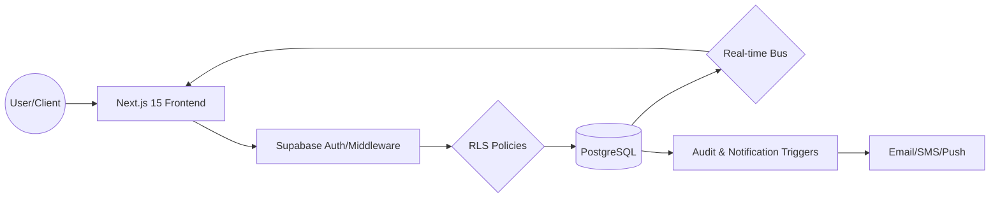

# Architectural Overview

This document outlines the high-level architecture and technical philosophy behind the TCNP Journey Management System.

## 🏗 System Architecture

The application is built on a modern, event-driven architecture designed for high availability and real-time responsiveness.

### 1. Frontend: Next.js 15 (App Router)
We utilize the latest Next.js 15 features to optimize performance and developer experience:
-   **Server Components:** Used for data-heavy views to reduce bundle size and improve SEO/Initial load time.
-   **Client Components:** Reserved for interactive elements like maps, forms, and real-time dashboards.
-   **Middleware:** Handles edge-level authentication redirects and role-based access before the user reaches the application.
-   **Streaming:** Leverages React Suspense for loading states in high-latency environments.

### 2. Backend: Supabase (PostgreSQL + Real-time)
Supabase serves as our primary backend, providing:
-   **PostgreSQL:** The source of truth for all journeys, papas, and audit logs.
-   **Row Level Security (RLS):** Our primary security layer, ensuring users can only access data relevant to their role.
-   **Real-time (WebSockets):** Powers the live tracking and instant notifications.
-   **Postgres Triggers:** Automates audit logging, user profile creation, and status transitions.

### 3. State Management & Data Fetching
-   **TanStack Query (React Query):** Manages server-side state, caching, and background synchronization.
-   **Zustand:** Handles client-side UI state (e.g., sidebar toggles, theme preferences) and ephemeral journey tracking data.
-   **Custom Hooks:** Encapsulates complex logic for maps, real-time subscriptions, and permissions.

---

## 📂 Core Folder Structure

```text
tcnp-journey-management/
├── app/                  # Next.js 15 App Router pages and layouts
│   ├── (auth)/          # Authentication routes (login, forgot-password)
│   ├── (dashboard)/     # Protected dashboard routes (RBAC enforced)
│   ├── api/             # Serverless backend routes
│   └── globals.css      # Core Design System styles
├── components/          # Reusable UI architecture
│   ├── ui/             # shadcn/ui base components (Atomic level)
│   ├── dashboard/      # Context-specific business logic components
│   └── maps/           # Leaflet Map abstractions
├── hooks/               # Domain-specific React hooks (useJourney, usePermissions)
├── lib/                 # Core utilities
│   ├── supabase/       # Supabase client configurations (browser/server)
│   └── utils.ts        # Tailwind merge & CN utilities
├── types/               # Strict TypeScript definitions
├── documentation/       # This documentation system
└── public/              # Static assets and PWA icons
```

---

## ⚡ Technical Design Principles

### Real-time First
The system is designed for "zero-refresh" operations. Any status change made by a Delta Oscar is instantly propagated to the Command Center and relevant stakeholders via WebSockets.

### Security by Default
No data is accessible without a valid JWT. Database-level RLS policies ensure that even if a frontend check is bypassed, the database remains secure.

### PWA Readiness
Designed as a Mobile-First application, the system supports:
-   **Service Workers:** For offline caching of assets.
-   **Manifest:** For native-like installation.
-   **Responsive Design:** Optimized for field use on mobile devices and command center use on large displays.

### Auditability
Every significant action (login, status change, incident report) is logged into the `audit_logs` table. This provides a clear trail for compliance and post-operation analysis.

### Type Safety
Full end-to-end type safety from the database to the UI using TypeScript and Supabase-generated types. This reduces runtime errors and significantly improves developer productivity during maintenance.

---

## 🗺 Data Flow Diagram



---
> [!TIP]
> When modifying the frontend, always check `types/database.types.ts` to ensure compatibility with the PostgreSQL schema.
